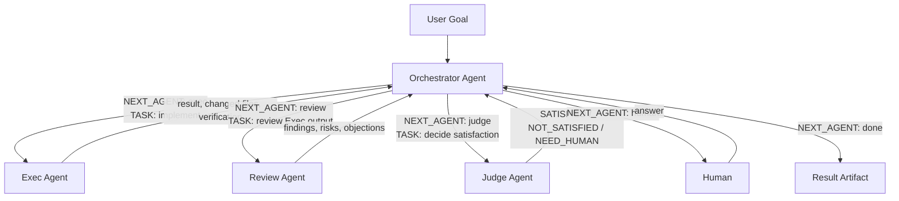

# Multi-Agent Self-Play-Loop driven AI-Native workflow

MASPL is a local multi-agent self-play CLI for coding tasks. It runs four explicit agents:

- `Orchestrator Agent`: receives the user goal and all agent outputs, then decides which agent runs next and what task it should execute.
- `Exec Agent`: plans and performs concrete workspace changes.
- `Review Agent`: reviews Exec output and raises risks or objections.
- `Judge Agent`: decides whether the result is `SATISFIED`, `NOT_SATISFIED`, or `NEED_HUMAN`.

Claude and Codex are backend adapters only. They run the selected agent task; they do not own the orchestration logic.

## Use Cases

MASPL is for optimization loops that are still mostly stitched together by humans today:

1. Coding workflow: write or modify code with Claude Code, review with Codex, iterate until the result is acceptable.
2. Prompt iteration workflow: analyze documents, write prompts, run test cases, optimize prompts, and repeat until the prompt meets the target.
3. Algorithm engineering workflow: search for better CTR-model hyperparameters or feature processing strategies, run experiments, evaluate AUC/F1, and repeat.

The goal is to let agents drive execution, review, judgment, and human interaction, while humans keep final approval and correction authority.

## Principles

1. Agent-first: MASPL is designed with agents as the core decision and execution layer, not as AI bolted onto a traditional workflow.
2. Minimal agent management: reuse local Codex and Claude Code capabilities through CLI/SDK integration instead of rebuilding bots or coding agents.
3. Human-in-the-Loop: agents can work automatically, but key uncertainty, approval, and correction points must go back to the human.

## Requirements

- Node.js 22+
- pnpm

## Backend Behavior

Backends are local execution adapters. MASPL reuses the local CLI environment, authentication, workspace, and permissions instead of managing a remote agent runtime.

- `--backend claude`: requires local Claude Code CLI installed, authenticated, configured with a working LLM API, available on `PATH`, and able to execute successfully.
- `--backend codex`: requires local Codex CLI installed, authenticated, configured with a working LLM API, available on `PATH`, and able to execute successfully. Codex is integrated through the [Codex SDK](https://github.com/openai/codex/tree/main/sdk).

## Install

```bash
pnpm install
pnpm run build
```

## Configure Roles

Create a default roles file:

```bash
node dist/cli.js init-roles
```

This creates `agentroles.yaml` with prompts, permissions, tool scopes, runtime budget, and backend defaults for the four agents.

## Run

Claude backend:

```bash
node dist/cli.js run \
  --task-name fix-tests-demo \
  --goal "Fix the failing tests and explain what changed" \
  --roles agentroles.yaml \
  --backend claude
```

Codex backend:

```bash
node dist/cli.js run \
  --task-name fix-tests-demo \
  --goal "Fix the failing tests and explain what changed" \
  --roles agentroles.yaml \
  --backend codex
```

Useful options:

```bash
--workspace ~/.maspl/project
--max-turns 30
--timeout-ms 1800000
```

`--task-name` is required and must be a single path segment. By default, MASPL runs inside:

```text
~/.maspl/project/<task_name>/
```

If `--workspace <root>` is provided, MASPL runs inside:

```text
<root>/<task_name>/
```

## Multi-Agent Flow



The Runtime only parses Orchestrator dispatch:

```text
NEXT_AGENT: exec | review | judge | human | done
TASK:
<task for the selected agent>
```

Invalid dispatch is retried once. If it is still invalid, the run fails instead of silently treating the task as complete.

## Output

Each run writes artifacts inside the task workspace:

```text
<workspace>/.maspl/runs/<run-id>/session.md
<workspace>/.maspl/runs/<run-id>/agent-sessions.json
<workspace>/.maspl/runs/<run-id>/result.md
```

`result.md` is the final delivery artifact. It should explain what was produced, where it lives in the workspace, and how to use or verify it.

`agent-sessions.json` records the per-agent backend session ids for the run. Different agents cannot share the same session id.

## Notes

- `runtime.allowedTools` is a hard allowlist. Agent role tools are intersected with it before backend execution.
- Exec is the only role intended to modify the workspace.
- Human-in-the-Loop uses `NEXT_AGENT: human`; no backend-specific human MCP tool is required.
- Gateway integrations such as Feishu or Telegram are not part of the MVP.
