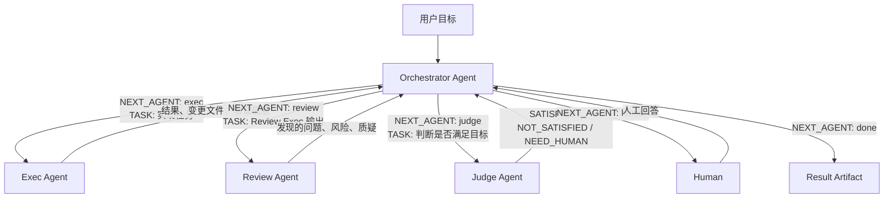

# Multi-Agent Self-Play-Loop driven AI-Native workflow

MASPL 是一个本地多 Agent self-play CLI，用于驱动 coding 任务。它包含四个明确角色：

- `Orchestrator Agent`：接收用户目标和所有 Agent 输出，决定下一步由哪个 Agent 执行，以及执行什么任务。
- `Exec Agent`：拆解计划并执行具体 workspace 修改。
- `Review Agent`：审查 Exec 的输出，提出风险、问题和反对意见。
- `Judge Agent`：判断结果是 `SATISFIED`、`NOT_SATISFIED` 还是 `NEED_HUMAN`。

Claude 和 Codex 只是 backend adapter。它们负责运行被选中的 Agent 任务，不拥有整体编排逻辑。

## 面向优化任务需求场景

MASPL 面向那些今天仍主要靠人工串联的优化循环：

1. 写代码场景：在 Claude Code 里写代码，在 Codex 里 Review，不断交互迭代，直到满意验收。
2. Prompt 迭代场景：分析文档、编写 Prompt、运行 TestCase、优化 Prompt、继续 TestCase，重复直到达到要求。
3. 算法工程场景：训练点击率模型时寻找最优超参和最优特征处理方式，预设方案、跑模型、评估 AUC/F1，并持续重复搜索。

这些流程中虽然可能已经用了 AI Coding，但串联、评估和判断仍然常由人工完成。MASPL 的目标是把执行、评估、判断和人工交互交给 Agent 驱动，人负责审核、验收、审批和纠错。

## 原则

1. Agent 为核心：从一开始就把 AI 作为核心决策与执行层来设计，而不是在传统流程上外挂 AI 工具。
2. 极简 Agent 管理框架：复用本地 Codex 和 Claude Code 的 CLI/SDK 能力，避免重复实现 bot、coding agent 等能力。
3. Human-in-the-Loop：AI 可以自动干活，但关键节点必须由人确认、审批、纠错；AI 负责执行、辅助和推荐，人掌握最终决策权。

## 核心依赖

MASPL 依赖本地 command line 工具和对应 SDK，复用本地环境、认证、workspace 和权限，不维护远程 agent runtime。

- Codex 通过本地 Codex CLI 和 [Codex SDK](https://github.com/openai/codex/tree/main/sdk) 接入。
- Claude 通过本地 Claude Code CLI 和 Claude Agent SDK 接入。

## 环境要求

- Node.js 22+
- pnpm

## Backend Behavior

Backend 只是本地执行 adapter。使用某个 backend 前，需要安装对应本地 CLI，配置好 LLM API/auth，并确认该 CLI 可以独立执行成功。

- `--backend claude`：要求本地 Claude Code CLI 已安装、已认证、已配置可用的 LLM API，并且在 `PATH` 中可用。
- `--backend codex`：要求本地 Codex CLI 已安装、已认证、已配置可用的 LLM API，并且在 `PATH` 中可用。

## 安装

```bash
pnpm install
pnpm run build
```

仓库内置 `.npmrc`，使用 npmmirror registry 以加速国内依赖安装。

## 配置角色

生成默认 roles 文件：

```bash
node dist/cli.js init-roles
```

该命令会创建 `agentroles.yaml`，其中包含四个 Agent 的 prompt、权限、工具范围、运行预算和默认 backend。

## 运行

Claude backend：

```bash
node dist/cli.js run \
  --task-name fix-tests-demo \
  --goal "Fix the failing tests and explain what changed" \
  --roles agentroles.yaml \
  --backend claude
```

Codex backend：

```bash
node dist/cli.js run \
  --task-name fix-tests-demo \
  --goal "Fix the failing tests and explain what changed" \
  --roles agentroles.yaml \
  --backend codex
```

常用参数：

```bash
--workspace ~/.maspl/project
--max-turns 30
--timeout-ms 1800000
```

`--task-name` 必填，并且必须是单个路径段。默认情况下，MASPL 会在以下目录运行：

```text
~/.maspl/project/<task_name>/
```

如果传入 `--workspace <root>`，MASPL 会在以下目录运行：

```text
<root>/<task_name>/
```

## 多 Agent 流程



Runtime 只解析 Orchestrator 的调度输出：

```text
NEXT_AGENT: exec | review | judge | human | done
TASK:
<给选中 Agent 的任务>
```

如果调度输出格式非法，Runtime 会要求 Orchestrator 重试一次。重试后仍然非法时，运行失败，不会静默当作任务完成。

## 产出

每次运行会在任务 workspace 内写入：

```text
<workspace>/.maspl/runs/<run-id>/session.md
<workspace>/.maspl/runs/<run-id>/agent-sessions.json
<workspace>/.maspl/runs/<run-id>/result.md
```

`result.md` 是最终交付物，应说明产出了什么、产出位于 workspace 的哪个路径，以及如何使用或验证。

`agent-sessions.json` 记录本次运行中每个 Agent 的 backend session id。不同 Agent 不能共享同一个 session id。

## 说明

- `runtime.allowedTools` 是硬 allowlist。Agent role tools 会先与它取交集，再传给 backend 执行。
- 只有 Exec 角色预期会修改 workspace。
- Human-in-the-Loop 通过 `NEXT_AGENT: human` 实现，不依赖 backend 专属的人审 MCP tool。
- 飞书、Telegram 等 gateway 集成不属于 MVP 范围。
